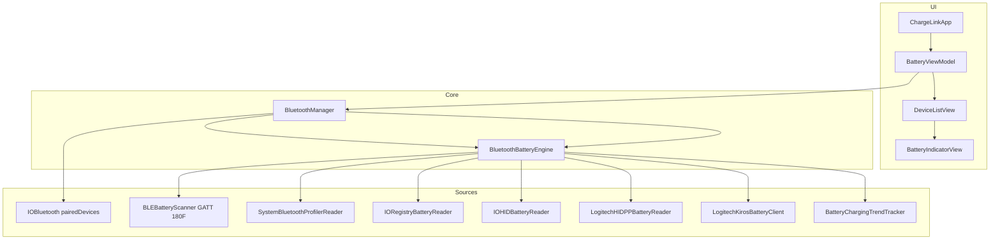

# ChargeLink

macOS menü çubuğu uygulaması: eşleştirilmiş ve **bağlı** Bluetooth cihazlarının pil yüzdesini ve (mümkün olduğunda) şarj durumunu gösterir. Sistem Ayarları → Bluetooth ile aynı veri kaynaklarına mümkün olduğunca yakın kalır; yalnızca Apple’ın kamuya açık API’leri ve sandbox izinleri kullanılır.

---

## İçindekiler

1. [Özet](#özet)
2. [Gereksinimler](#gereksinimler)
3. [Derleme ve çalıştırma](#derleme-ve-çalıştırma)
4. [Mimari](#mimari)
5. [Pil verisi kaynakları](#pil-verisi-kaynakları)
6. [Şarj durumu algılama](#şarj-durumu-algılama)
7. [Dosya yapısı](#dosya-yapısı)
8. [Sandbox ve yetkiler](#sandbox-ve-yetkiler)
9. [Gizlilik](#gizlilik)
10. [Sınırlamalar ve bilinen durumlar](#sınırlamalar-ve-bilinen-durumlar)
11. [Hata ayıklama](#hata-ayıklama)
12. [Lisans](#lisans)

---

## Özet

| Özellik | Açıklama |
|--------|----------|
| **Arayüz** | `MenuBarExtra` — Dock simgesi yok (`NSApplicationActivationPolicy.accessory`) |
| **Cihaz listesi** | `IOBluetoothDevice.pairedDevices()` içinden `isConnected == true` olanlar |
| **Pil %** | Çoklu kaynak birleştirme (BLE GATT, IORegistry, IOHID, `system_profiler`) |
| **Şarj göstergesi** | Yeşil pil + animasyonlu şimşek (`BatteryIndicatorView`) |
| **Yenileme** | Manuel + 30 sn zamanlayıcı + Bluetooth bağlantı/kopma bildirimleri |
| **Hedef** | macOS 14.0+, Swift 5, App Store sandbox |

Menü çubuğu simgesi **sabit**: `bolt.horizontal.fill` — pil seviyesine göre değişmez.

---

## Gereksinimler

- **macOS 14.0** veya üzeri
- **Xcode** (tam sürüm; yalnızca Command Line Tools yeterli değil)
- Bluetooth açık ve cihazlar macOS ile eşleştirilmiş / bağlı
- Logitech cihazlarda **şarj durumu** için genelde **Logi Options+** (veya arka planda Kiros agent) çalışır durumda olmalı

---

## Derleme ve çalıştırma

```bash
# Depoyu klonladıktan sonra
open ChargeLink.xcodeproj
```

1. Xcode’da şema: **ChargeLink** → **My Mac**
2. **Product → Run** (⌘R)
3. İlk çalıştırmada **Bluetooth** izni istenebilir (CoreBluetooth)
4. Menü çubuğundaki simgeye tıklayın → cihaz listesi ve **Yenile** / **Çıkış**

### İzinler (kullanıcı)

| İzin | Neden |
|------|--------|
| Bluetooth | BLE GATT (`CBCentralManager`) ve bağlı cihazlar |
| Yerel ağ (gerekirse) | Logi Kiros WebSocket (`127.0.0.1`) |

---

## Mimari

### Veri akışı



### Yenileme döngüsü

1. `BluetoothManager.refreshDevices()` (tek seferde bir tarama; `isRefreshing` kilidi)
2. `BluetoothBatteryEngine.refreshAllCaches()` — tüm alt sistemlerden önbellek doldurulur
3. `fetchConnectedDevices()` — her bağlı cihaz için `resolveBattery(name:address:)`
4. UI sıralaması: pil verisi olanlar üstte, sonra ada göre
5. `NotificationCenter` → `.chargeLinkDevicesDidUpdate`

**Periyodik tarama:** `Timer` ile 30 saniyede bir.  
**Anlık:** `IOBluetooth` bağlantı/kopma ve ilgili `NSNotification` gözlemcileri.

---

## Pil verisi kaynakları

Öncelik ve rol özeti (`BluetoothBatteryEngine.refreshAllCaches` birleştirme sırası):

| Sıra | Modül | Teknoloji | Ne sağlar |
|------|--------|-----------|-----------|
| 1 | `BLEBatteryScanner` | CoreBluetooth | GATT `0x180F` / `0x2A19` (seviye), `0x2A1A` (güç durumu) |
| 2 | `SystemBluetoothProfilerReader` | `system_profiler SPBluetoothDataType` | AirPods L/R/Kutu, Apple ekosistemi metin çıktısı |
| 3 | `IORegistryBatteryReader` | IOKit IORegistry | `BatteryPercent`, `AppleDeviceBatteryLevel`, HID event servisleri |
| 4 | `IOHIDBatteryReader` | IOHID | Canlı element değerleri; Logitech vendor sayfa `65347` usage `514` |
| 5 | `LogitechKirosBatteryClient` | WebSocket `ws://127.0.0.1` | Options+ / Kiros: `charging`, `percentage` |
| 6 | `LogitechHIDPPBatteryReader` | IOHID + HID++ 2.0 | Feature `0x1004`, `0x1001`, `0x1000` |
| — | `BatteryChargingTrendTracker` | UserDefaults | Yüzde artışı sezgisi (yedek) |

Cihaz başına çözümleme (`resolveBattery`) öncelik sırası:

1. Birleştirilmiş önbellek (`mergedReadingsByKey`)
2. AirPods / kulaklık bileşenleri (IORegistry L/R/Case)
3. CoreBluetooth
4. IORegistry (agresif derin tarama dahil)
5. IOHID

### Cihaz adı eşleştirme

`DeviceNameMatcher` farklı kaynaklardaki isimleri eşler:

- Küçük harf, apostrof normalizasyonu
- Kısmi içerme (`contains`)
- Token örtüşmesi (ör. `AirPods Pro` ↔ `Onur (AirPods Pro)`)

### AirPods çoklu pil

`AirPodsBatteryComponents` → `L: % R: % C: %` metni; birincil yüzde genelde minimum bud değerlerinden alınır.

---

## Şarj durumu algılama

UI’da `isCharging == true` olduğunda:

- Pil dolgusu yeşil
- Pil gövdesi içinde beyaz `bolt.fill` (nabız animasyonu)
- Yüzde yanında küçük yeşil şimşek

### Kaynaklar

| Kaynak | Koşul | Not |
|--------|--------|-----|
| **Logi Kiros** | Options+ agent WebSocket yanıt verir | En güvenilir Logitech yolu; `charging: true` |
| **BLE `0x2A1A`** | Bit 6 (`0x40`) set | Birçok BLE cihazda yok |
| **HID++** | `BatteryStatus` baytı 1–4 veya voltage flags `0x80` | Sandbox / `IOHIDDeviceSetReport` kısıtı olabilir |
| **IORegistry** | `BatteryIsCharging`, `IsCharging`, `ExternalConnected`, … | Logitech’te nadiren dolu |
| **IOHID vendor** | Sayfa `65347`, usage `513/515/516/517` | Cihaza bağlı |
| **Trend** | Ardışık yenilemede % artışı | Kablo takılıyken yavaş artış; %100’de işe yaramaz |

`applyChargingFlags` tüm şarj sinyallerini `OR` ile birleştirir.

### Logitech Kiros WebSocket

- Port adayları: `9010`, `57318`, `57321`, `57324`, …
- Protokol: `Sec-WebSocket-Protocol: json`
- Abonelik: `/battery/state/changed`, `/devices/state/changed`
- Kiros her mesajdan sonra aboneliği iptal edebilir; her broadcast sonrası `SUBSCRIBE` yenilenir

**Önemli:** Options+ kapalıysa şarj bilgisi çoğu Logitech BLE cihazında **görünmeyebilir**.

### HID++ 2.0 (kısa teknik)

- Kısa rapor ID: `0x10`, uzun: `0x11`
- Cihaz indeksi: `0x01` (doğrudan BLE), `0xFF` (alıcı)
- İstek kimliğine periferik için `sw_id` (alt 4 bit) eklenir — Solaar ile uyumlu
- Feature keşfi: `ROOT` → `FEATURE_SET` → indeks ile `0x1004` / `0x1001` / `0x1000`

---

## Dosya yapısı

```
ChargeLink/
├── ChargeLinkApp.swift          # @main, MenuBarExtra
├── AppDelegate.swift            # accessory activation policy
├── BluetoothManager.swift       # IOBluetooth listesi, IORegistryBatteryReader, gözlemciler
├── BluetoothBatteryEngine.swift # Önbellek birleştirme + resolveBattery
├── BluetoothDevice.swift        # Model + DeviceClass + SF Symbol eşlemesi
├── BatteryViewModel.swift       # SwiftUI köprüsü, tarama mesajları
├── DeviceListView.swift         # Popover liste, Yenile / Çıkış
├── BatteryIndicatorView.swift   # Özel pil şekli + şarj animasyonu
├── BatteryReading.swift         # Birleşik pil sonucu + AirPods bileşenleri
├── BLEBatteryScanner.swift      # CoreBluetooth GATT
├── BLEReading.swift             # BLE önbellek satırı
├── SystemBluetoothProfilerReader.swift
├── IOHIDBatteryReader.swift
├── LogitechHIDPPBatteryReader.swift
├── LogitechKirosBatteryClient.swift
├── BatteryChargingTrendTracker.swift
├── ChargeLink.entitlements
└── Assets.xcassets/
```

`BluetoothManager.swift` içinde ayrıca `IORegistryBatteryReader`, `BluetoothAddressNormalizer`, `BatteryValueNormalizer` ve bağlantı köprüsü (`BluetoothConnectionBridge`) bulunur.

---

## Sandbox ve yetkiler

`ChargeLink.entitlements`:

| Anahtar | Amaç |
|---------|------|
| `com.apple.security.app-sandbox` | App Store sandbox |
| `com.apple.security.device.bluetooth` | CoreBluetooth |
| `com.apple.security.device.usb` | USB/HID cihaz yolları |
| `com.apple.security.network.client` | `localhost` WebSocket (Kiros) |
| `com.apple.security.files.user-selected.read-only` | Kullanıcı dosya seçimi (gelecek kullanım) |
| `temporary-exception.iokit-user-client-class` | `IOHIDLibUserClient`, `IOHIDEventServiceUserClient` |

Özel çekirdek uzantısı veya Logitech özel XPC kullanılmaz.

---

## Gizlilik

- Veri yalnızca **yerelde** işlenir; harici sunucuya pil bilgisi gönderilmez.
- Kiros bağlantısı yalnızca **127.0.0.1** üzerindedir (kullanıcı makinesindeki Logi agent).
- `BatteryChargingTrendTracker` son yüzdeleri `UserDefaults` ile saklar (şarj sezgisi için).

---

## Sınırlamalar ve bilinen durumlar

1. **Yalnızca bağlı cihazlar** — Eşleştirilmiş ama bağlı olmayan cihazlar listede yok.
2. **Logitech şarj** — Çoğu model standart BLE şarj bayrağı vermez; Options+ veya HID++ gerekir.
3. **Sandbox** — `IOHIDDeviceSetReport` / `IOHIDManagerOpen` bazı ortamlarda `0xe00002c7` ile başarısız olabilir; IORegistry-only yollar devreye girer.
4. **İsim uyumsuzluğu** — IOBluetooth adı ile BLE peripheral adı farklı olabilir; `DeviceNameMatcher` bunu kısmen giderir.
5. **system_profiler** — Sandbox veya dil (TR/EN) çıktı formatına bağlı; `LANG=en_US.UTF-8` ile çalıştırılır.
6. **Menü çubuğu simgesi** — Pil seviyesine göre dinamik değil (bilinçli tasarım).
7. **App Store incelemesi** — `temporary-exception.iokit-user-client-class` her sürümde gerekçelendirilmeli.

---

## Hata ayıklama

`BluetoothDebug.isEnabled = true` (varsayılan) iken Xcode konsolunda `[ChargeLink]` önekli loglar:

| Log örneği | Anlam |
|------------|--------|
| `BLE: stored … (charging)` | GATT şarj bayrağı okundu |
| `Kiros: got N device(s) from port …` | Logi WebSocket başarılı |
| `Kiros: no agent WebSocket` | Options+ agent yok / port kapalı |
| `HID++: … ⚡` | HID++ şarj algılandı |
| `HID++: no battery feature replies` | HID++ yanıt yok |
| `Battery cache: … charging: …` | Önbellekte şarj işaretli cihazlar |
| `IOHID snapshot: manager open failed` | Sandbox HID engeli |

Manuel test:

1. Logi Options+ açık, cihazlar şarjda
2. ChargeLink → **Yenile**
3. Konsolda `Kiros:` ve `charging:` satırlarını kontrol et

---

## Lisans

Bu depo için lisans dosyası eklenmemişse kullanım ve dağıtım koşulları depo sahibi tarafından belirlenir. Üçüncü parti referanslar: [Solaar](https://github.com/pwr-Solaar/Solaar) (HID++ davranışı), [LGBattery](https://github.com/bmrussell/LGBattery) (Kiros WebSocket API örneği).

---

## Katkı

Hata bildiriminde mümkünse şunları ekleyin:

- macOS sürümü
- Cihaz modeli (ör. Logi M650 L, MX Keys Mini, AirPods)
- Logi Options+ çalışıyor mu?
- `[ChargeLink]` konsol çıktısı (Kiros / HID++ / BLE satırları)

Önerilen geliştirme alanları: Kiros cihaz ID ↔ ürün adı eşlemesini sağlamlaştırma, HID++ oturumunu IOHID event servisi ile tekilleştirme, birim / entegrasyon testleri.
